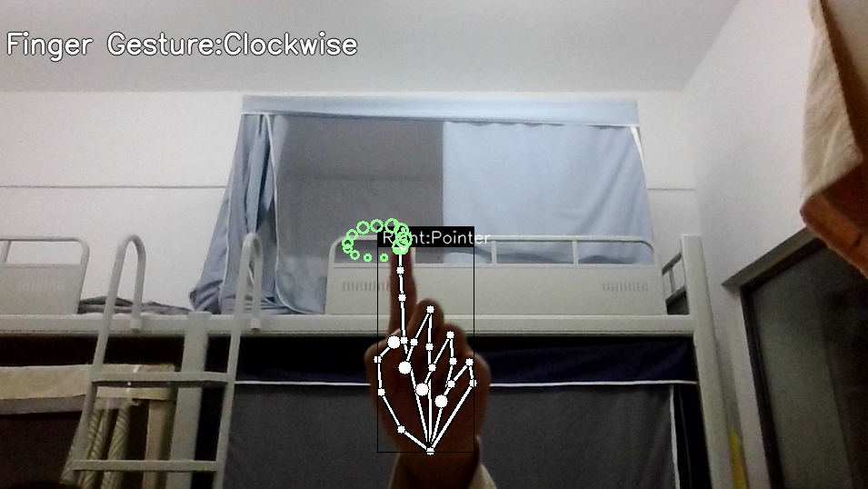
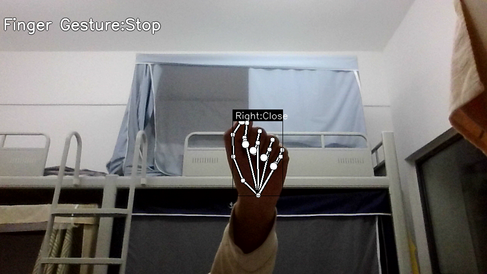
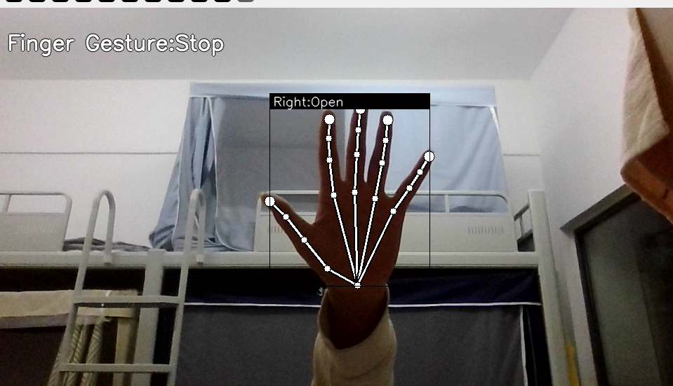
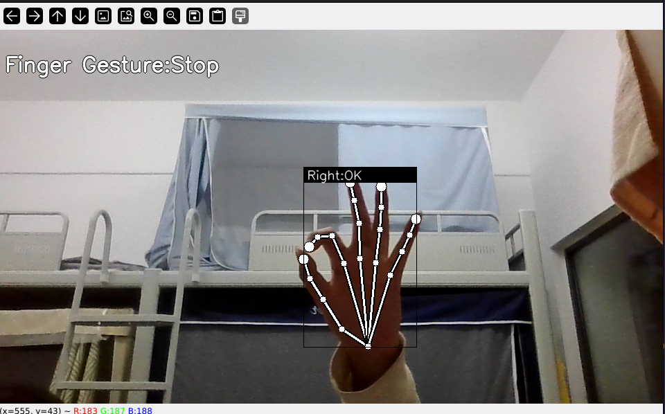
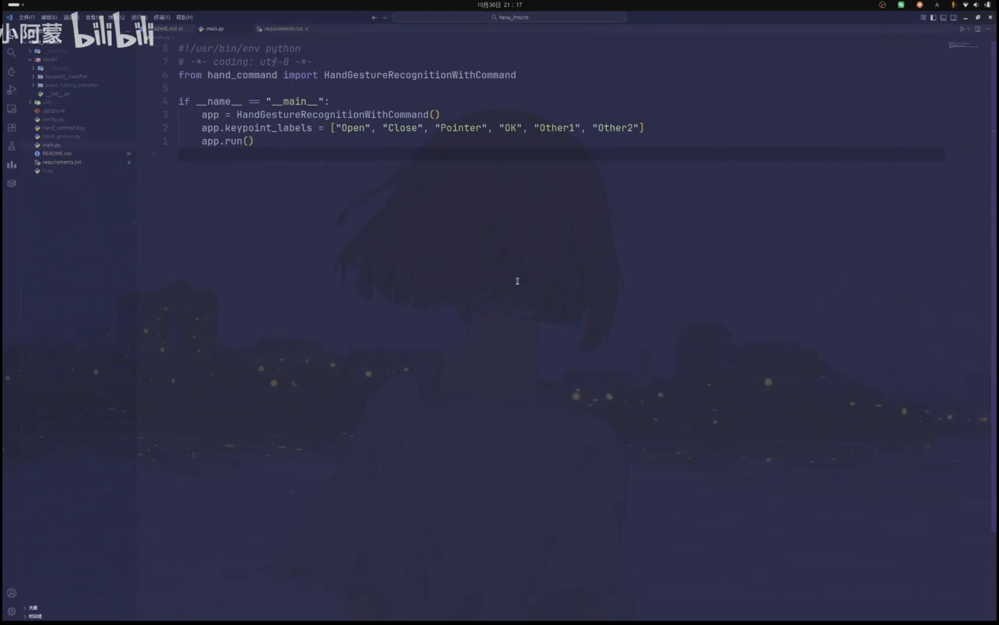

# 团队项目 Henu_Gesture_Interaction


---

## 🧩 模块说明

| 模块 | 功能简介 |
|------|-----------|
| `main.py` | 主程序入口，捕捉摄像头视频并调用手势识别与控制模块 |
| `hand_gesture.py` | Mediapipe 检测手部关键点并调用分类模型进行手势识别 |
| `hand_command.py` | 根据识别到的手势执行系统指令（如鼠标移动、点击） |
| `model/` | 存放训练好的手势分类模型与标签 |
| `utils.py` | FPS 计算、关键点归一化、图像绘制等辅助功能 |
| `config.py` | 模型路径、摄像头索引、GPU 使用开关等全局配置 |

---

## 🧠 手势识别逻辑

系统通过 **Mediapipe Hands** 检测 21 个手部关键点，再将关键点归一化后输入 **KeyPointClassifier** 模型，输出对应的手势类别。

典型流程：

```python

1️⃣ 捕获视频帧
2️⃣ Mediapipe 检测手部关键点
3️⃣ 关键点归一化
4️⃣ KeyPointClassifier 推理手势类别
5️⃣ 调用 HandCommand 执行操作

```






---


## 📁文件树：HENU_PROJRCT
<details>
<summary>展开查看</summary>

```text
HENU_PROJRCT
├── config.py
├── hand_command.py
├── hand_gesture.py
├── main.py
├── model
│   ├── __init__.py
│   ├── keypoint_classifier
│   │   ├── keypoint.csv
│   │   ├── keypoint_classifier.hdf5
│   │   ├── keypoint_classifier.onnx
│   │   ├── keypoint_classifier.py
│   │   ├── keypoint_classifier.tflite
│   │   └── keypoint_classifier_label.csv
│   └── point_history_classifier
│       ├── point_history.csv
│       ├── point_history_classifier.hdf5
│       ├── point_history_classifier.py
│       ├── point_history_classifier.tflite
│       └── point_history_classifier_label.csv
├── README.md
├── ts.py
└── utils
    ├── __init__.py
    └── cvfpscalc.py
```
</details> 

---

## 🧱 扩展方向

🔹 控制 PPT / 浏览器 / 视频播放

🔹 控制 机械臂动作模仿手势

🔹 与语音识别结合 → 多模态人机交互

🔹 训练个性化手势 → 专属控制方案

---

## 手势演示视频

<a href="https://www.bilibili.com/video/BV1mmyaB1Eqo?t=0" target="_blank">
  
</a>
> 点击图片观看 Bilibili 视频
---