# 🤖 Henu_Gesture_Interaction

> 人机协同 · 手势控制 · 智能交互
> 基于 **MediaPipe + 深度学习分类模型** 的实时手势识别与系统控制项目

---

## 🧩 模块说明

| 模块                | 功能简介                             |
| ----------------- | -------------------------------- |
| `main.py`         | 🎬 主程序入口，捕捉摄像头视频并调用手势识别与控制模块     |
| `hand_gesture.py` | ✋ MediaPipe 检测手部关键点并调用分类模型进行手势识别 |
| `hand_command.py` | 🖱️ 根据识别到的手势执行系统指令（鼠标移动、点击等）     |
| `model/`          | 🧠 存放训练好的手势分类模型与标签文件             |
| `utils.py`        | ⚙️ FPS 计算、关键点归一化、图像绘制等辅助功能       |
| `config.py`       | 🧾 模型路径、摄像头索引、GPU 使用开关等全局配置      |

---

## 🧠 手势识别逻辑

系统基于 **MediaPipe Hands** 模块提取 21 个关键点坐标，
经过归一化处理后输入 **KeyPointClassifier** 模型，输出手势类别。

**流程图：**

```python
1️⃣ 捕获视频帧  
2️⃣ MediaPipe 检测手部关键点  
3️⃣ 关键点归一化处理  
4️⃣ KeyPointClassifier 推理手势类别  
5️⃣ HandCommand 执行系统操作
```

---

## ✋ 手势示例

<div align="center">

| 手势    | 示例图                                                     |
| ----- | ------------------------------------------------------- |
| Point |  |
| Close |  |
| Open  |    |
| OK    |        |

</div>

---

## 📁 文件结构

```mermaid
%% 目录结构树状图
flowchart TB
    A[Henu_Gesture_Interaction]
    A1[config.py]
    A2[CSV]
    A2_1[main_csv]
    A2_1_1[main_data]
    A2_1_1_1[keypoint.csv]
    A2_1_1_2[point_history.csv]
    A2_1_2[main_lable]
    A2_1_2_1[keypoint_classifier_label.csv]
    A2_1_2_2[point_history_classifier_label.csv]
    A2_2[other_csv]
    A3[doc]
    A3_1[Close.png]
    A3_2[OK.png]
    A3_3[Open.png]
    A3_4[Point.png]
    A3_5[preview.png]
    A4[hand_command.py]
    A5[hand_gesture.py]
    A6[keypoint_data]
    A6_1[keypoint_data.csv]
    A7[LICENSE]
    A8[main.py]
    A9[model]
    A9_1[main_model]
    A9_1_1[keypoint_classifier.tflite]
    A9_1_2[point_history_classifier.tflite]
    A9_2[other_model]
    A9_2_1[keypoint_classifier.tflite]
    A10[README.md]
    A11[requirements.txt]
    A12[train]
    A12_1[__init__.py]
    A12_2[collect_gesture_data.py]
    A12_3[train_keypoint_classifier.py]
    A13[ts.py]
    A14[utils]
    A14_1[__init__.py]
    A14_2[Classifier]
    A14_2_1[keypoint_classifier.py]
    A14_2_2[point_history_classifier.py]
    A14_3[cvfpscalc.py]

    %% 层级关系
    A --> A1
    A --> A2
    A2 --> A2_1
    A2_1 --> A2_1_1
    A2_1_1 --> A2_1_1_1
    A2_1_1 --> A2_1_1_2
    A2_1 --> A2_1_2
    A2_1_2 --> A2_1_2_1
    A2_1_2 --> A2_1_2_2
    A2 --> A2_2
    A --> A3
    A3 --> A3_1
    A3 --> A3_2
    A3 --> A3_3
    A3 --> A3_4
    A3 --> A3_5
    A --> A4
    A --> A5
    A --> A6
    A6 --> A6_1
    A --> A7
    A --> A8
    A --> A9
    A9 --> A9_1
    A9_1 --> A9_1_1
    A9_1 --> A9_1_2
    A9 --> A9_2
    A9_2 --> A9_2_1
    A --> A10
    A --> A11
    A --> A12
    A12 --> A12_1
    A12 --> A12_2
    A12 --> A12_3
    A --> A13
    A --> A14
    A14 --> A14_1
    A14 --> A14_2
    A14_2 --> A14_2_1
    A14_2 --> A14_2_2
    A14 --> A14_3

```

<details>
<summary>点击展开查看</summary>



</details>

---

## 🚀 扩展方向

* 🎥 **PPT / 浏览器 / 视频播放控制**
* 🤖 **机械臂动作模仿手势**
* 🗣️ **语音识别 + 手势识别 → 多模态人机交互**
* 🧩 **个性化手势训练 → 自定义控制方案**

---

## 🎬 手势演示视频

<div align="center">
  <a href="https://www.bilibili.com/video/BV1mmyaB1Eqo?t=0" target="_blank">
    
  </a>
  <br>
  <em>点击图片即可跳转至 Bilibili 视频演示</em>
</div>

---

## 🧑‍💻 开发环境

* Python ≥ 3.10
* OpenCV ≥ 4.8
* MediaPipe ≥ 0.10
* TensorFlow Lite / ONNX Runtime
* NumPy, PyAutoGUI, time, csv 等常用库

---

## 📜 License

本项目遵循 **MIT License** 开源协议，欢迎学习与二次开发。
如使用于论文、竞赛或展示，请注明出处：
**Henu_Gesture_Interaction 团队项目**

---

✨ *让计算机“看懂”手势，让交互更自然。*
